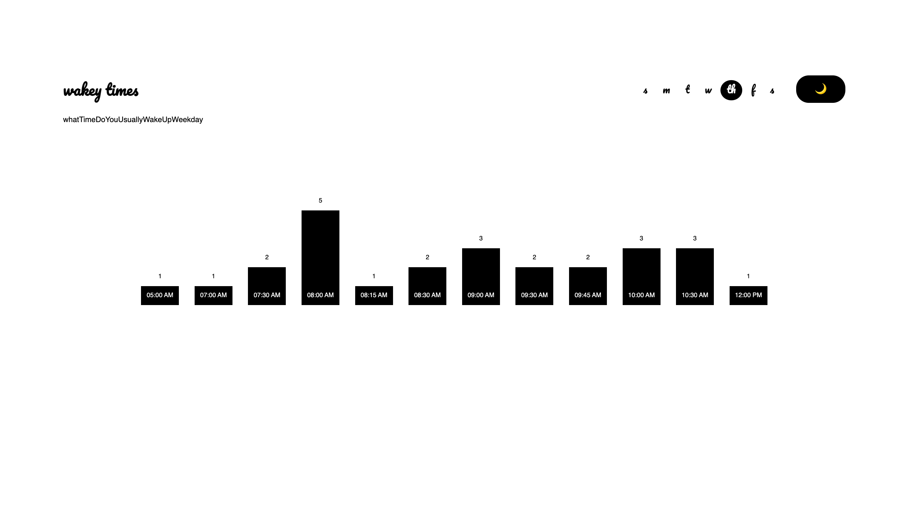
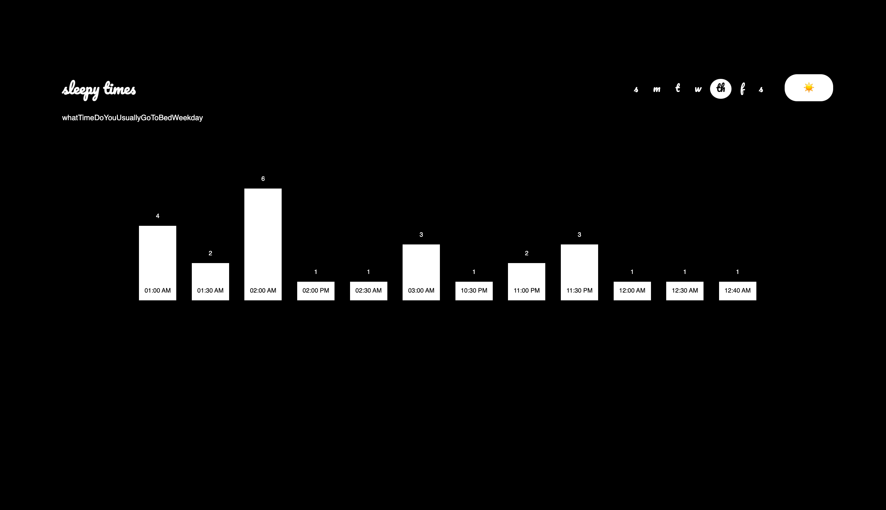
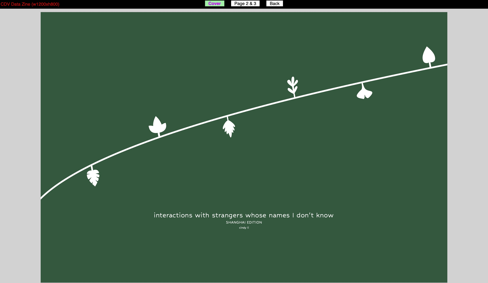

# Critical Data & Visualization 🦕

Hi! I am Cindy and this repository holds my work for the class [Critical Data & Visualization](https://cdv.leoneckert.com/) taught by [Leon Eckert](http://leoneckert.com/).  

mainly using javascript + d3

## Some Noteable work 👻
#### Coding Exercises

[coding exercise 2 - Wakey/Sleepy](coding-exercises/coding-exercise-2_formdata/)

[coding exercise 4 - Shanghai Cafes](coding-exercises/coding-exercise-4_grouping)

[coding exercise 5 - Rosling Recreation](coding-exercises/coding-exercise-5_rosling)

[coding exercise 8 - China Travels](coding-exercises/coding-exercise-8_maps)

#### Projects

[data zine - interactions with strangers i don't know](projects/data-zine/index.html)

[data story - WORK IN PROGRESS 🚧](projects/data-story/code/index.html)

#### Extras
[scraping all 905 pokemon with python](https://github.com/clcl915/cdv-student/tree/main/labs/lab-09/scraping)