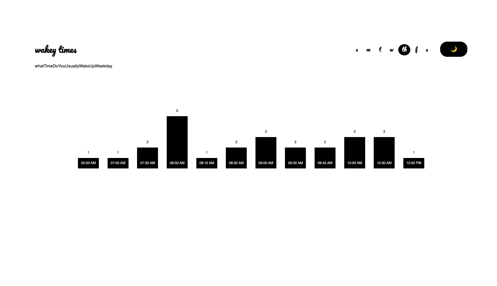
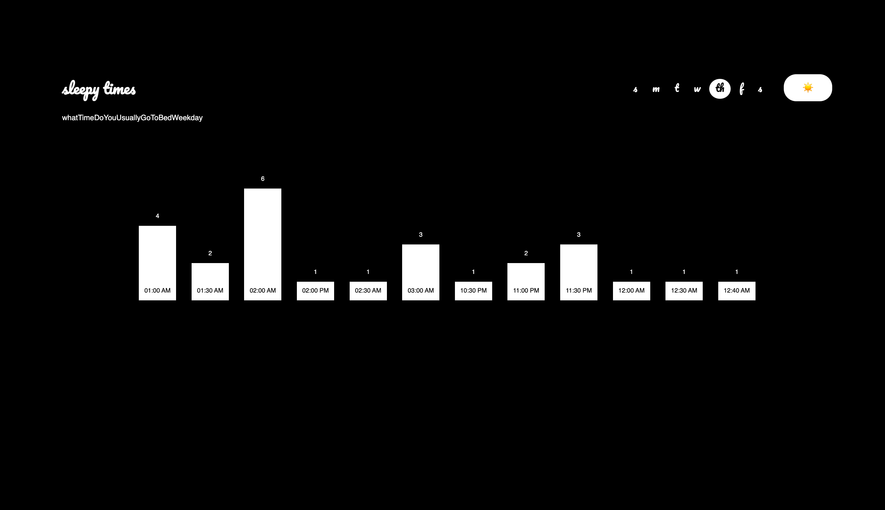
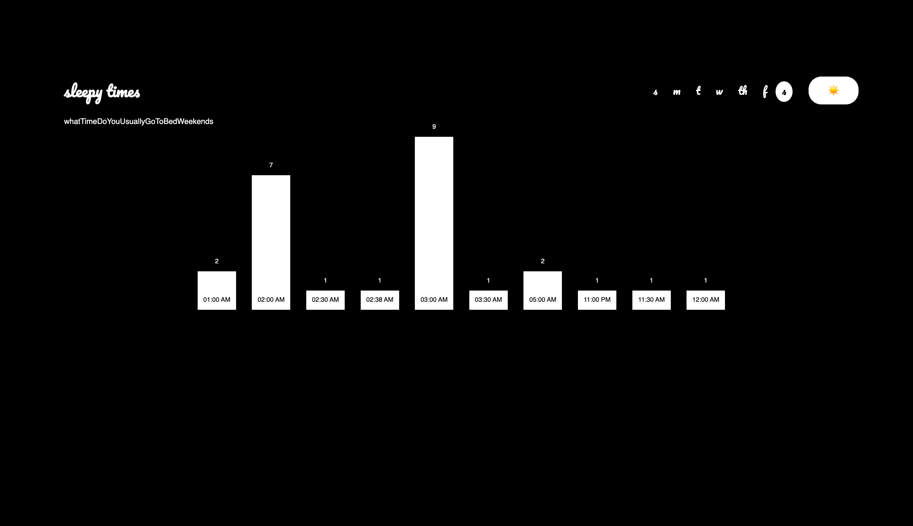
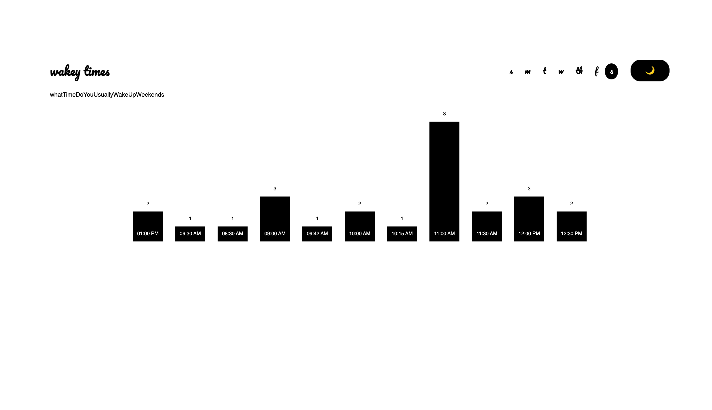

## Coding Exercise 2 - Form Data, no D3.js 

**wakey/sleepy times**

Wakey/Sleepy Times utilized data from a Google Form and transformed it into JSON format. This data was then visualized with simple HTML, CSS, and vanilla Javascript.

Vistors can toggle the 🌙 and ☀️ button to show when our surveyers sleep and wake up. Vistors can also click on different days of the week to see the difference between weekday and weekend patterns.

Try this project out [here](https://clcl915.github.io/cdv-student/coding-exercises/coding-exercise-2_formdata/) !

Preview the Google Form [here](https://forms.gle/UNxy3tXsHdDsNpWy9)

