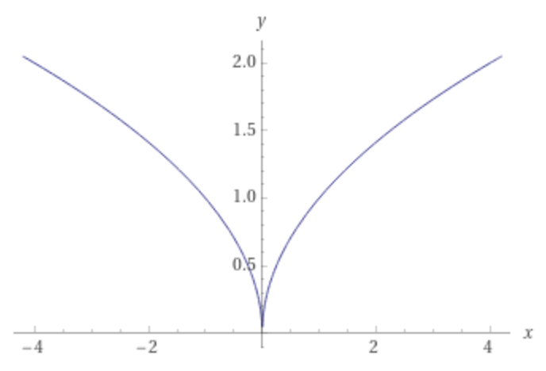

cdv datazine s.2022

## interactions with strangers whose names I don't know

Check out the live verison [here](https://clcl915.github.io/cdv-student/projects/data-zine/)

### Data

In 2 weeks, I recorded my interactions with strangers whose names I did not know. 

Originally my plan was to record objects in the sky, but it's hard to justify what is really "in the sky." One day, I was walking to Century Ave station and 1 guy asked me for directions to Shanghai street at Century Link. With that in mind, I recorded my data everyday by jotting down interactions with security guards, staff workers, random people, etc. I also recorded some properties of each interaction which include: duration (in seconds), who, where, type of interaction, and my reaction.  

I used a Google Sheet to record and export to JSON.

### Visual Design

When I was thinking about the visual design for this visualization, I started by thinking about the word "interactions." From interactions, I thought about interactions → connections → links → roads → branches → paths. I liked the tree idea. There's a root (me) that branches out to interact with different kinds of people and why. 

So I used branches to represent the different types of interactions I had. And I used leaves on the branches to visual the individual interactions with different properties.

I chose to have two visualizations for this project. For the middlespread, I wanted to show a big wide display of my overall tree. For the back page, I wanted to show a gallery of the individual leaves. 

**Branches** 

To visualize the branches, I used the square root equation y=x^0.5 to make this kind of outward branch. 

y=x^0.5

Then I make the curves symmetrical, I changed the equation to be the square root of the absolute value of x. 

y=|x|^0.5

Then I was able to manipulate the curves by multiplying by a factor of a. 
y=a|x|^0.5

**Leaves** 

To visualize the leaves, I custom made the leaves with Adobe Illustrator. Earlier I ran into the problem of not having my paths align at (0,0). So this time, I was able to design my leaf paths in Illustrator and exported them to SVG. 

**Inner Leaf** 

To visualize my reactions, I custom made the patterns inside my leaves with Adobe Illustrator. I took inspiration from real life leaves. I looked at what kind of patterns leaves have.   

### Thoughts

This project took a lot of hours to complete. Because I made the paths in Illustrator, I had to go back and fine tune the little edges and positioning. 

I also had some trouble with finding a suitable color palette. I originally picked bright colors but I changed them to have more muted light colors instead. Still took a lot of tries to find one that looked good on this green background.  

Surprisingly after visiting a lot inspiration jsfiddles, the graphing along the square root curve process was pretty smooth.    

If this wasn’t on print, I would have loved to add in some animation and include the notes that I recorded. As of right now, the current version with no interaction is the version for print. But as a little addition or maybe as a little easter egg, the back page has some additional notes when the user hovers over.   
