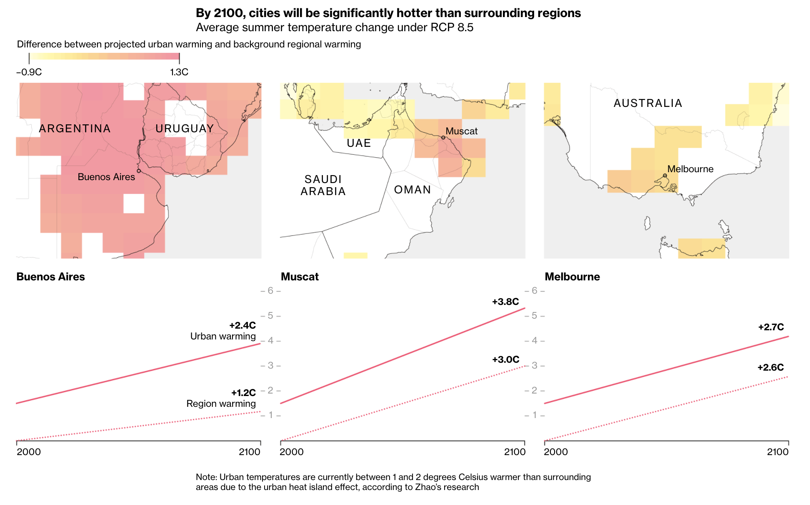
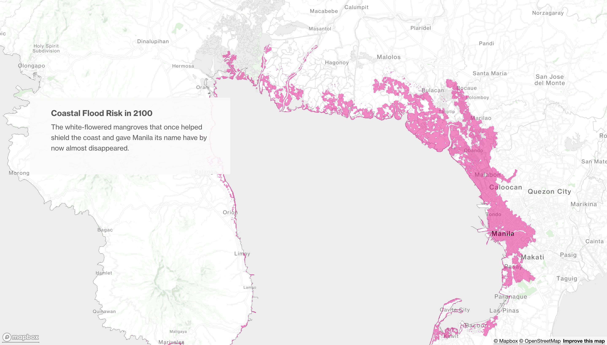

## Response to Data Feminism

Source: [Bloomberg Green](https://www.bloomberg.com/graphics/2021-cities-climate-victims/)

This article was titled: Whatver Climate Change Does to the World, Cities Will Be Hit Hardest. This article addresses the severity of the current climate crisis by illustrating the rise in urban warming and coastal flooding with data visualization. It also touches upon other important issues which include displacement, spiking housing prices, and an exacurbation of extreme events that require rescuing. 

These visualizations are leveraging emotions which leads to dread, fear, and worry. This article uses parallax scrolling to show progression over time and progression over severity. As the reader scrolls down and down, the visualizations get redder and bigger. Midway through the article, the visualization for coastal flooding is shown. The parallax scrolling effect moves the reader from Asia to Jakarta to Egypt to Manila. And in each city, the situation gets worse and worse over time. 

These data visualizations are framed around emotion. This article included the worst-case sceanrio RCP 8.5 even though "scientists use it less and less." But they chose to include this to show readers how this world could wind up to. This is definitely not a "neutral" visualization, but rather an "emotional" visualization. By embracing emotion, this data visualization helps reader remember that the world is in a climate crisis. It shows them that one of their cities may be in danger at the end of the century.    
