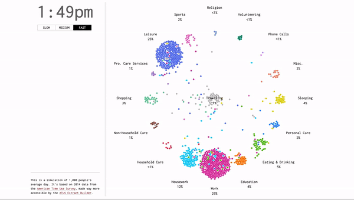
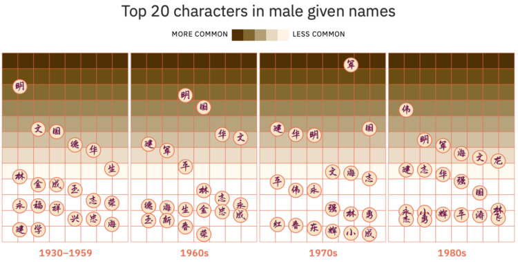

## Two Data Stories

[A Day in the Life of Americans](https://flowingdata.com/2015/12/15/a-day-in-the-life-of-americans/)

This data was to simulate a single day for 1000 Americans. With data collected from the American Time Use Survey (ATUS), this visualization shows a slow start for Americans in the beginning of the day at 4am and progressively gets more active throughout the day. This visualization shows clustering and distributions within a sample size of 1000.

[What can we tell from the evolution of Han Chinese names?](https://kontinentalist.com/stories/a-cultural-history-of-han-chinese-names-for-girls-and-boys-in-china)

This data was to simulate a single day for 1000 Americans. With data collected from the American Time Use Survey (ATUS), this visualization shows a slow start for Americans in the beginning of the day at 4am and progressively gets more active throughout the day. This visualization shows clustering and distributions within a sample size of 1000.

